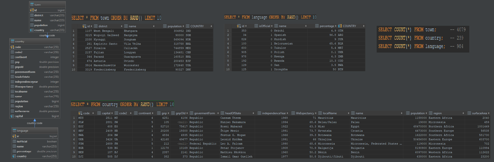
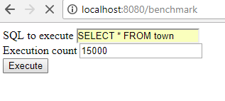
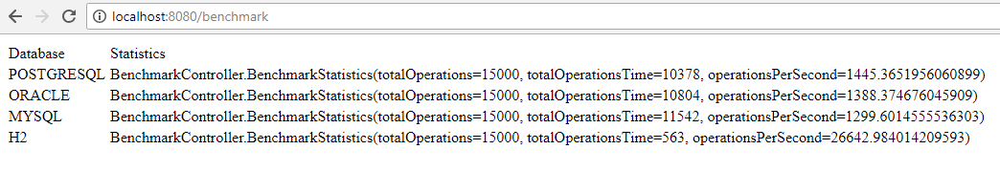

# Prerequisite

1. Install
    * Spring CLI
    * maven
    * git
    * java v1.8+
    * mysql
    * postgresql
    * oracle
    * <s>mongodb (not supported yet)</s>
2. Setup application settings

# Run

    mvn spring-boot:run
    
# Usage

    
    
1. Go to: http://localhost:8080/benchmark
2.  
3. 

# Test

    mvn test
    
# Todo

* unit testing
* separate text field for mongo commands
* bigger database
